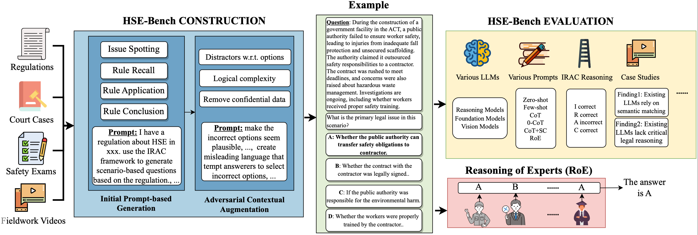

# hse-bench
This is the code for the paper "LLM-based HSE Compliance Assessment: Benchmark, Performance, and Advancements".

## Pipeline


## Dataset Statistics
| Description                                      | Value   |
|--------------------------------------------------|---------|
| No. of questions in regulation                  | 448     |
| No. of questions in court case                  | 152     |
| No. of questions in exam                        | 320     |
| No. of questions in video                       | 100     |
| Total number of IRAC questions                  | 1020    |
| Avg. words per question in regulation           | 60.24   |
| Avg. words per question in court case           | 111.76  |
| Avg. words per question in exam                 | 92.49   |
| Avg. words per question in video                | 106.65  |
| Avg. words per option in regulation             | 10.99   |
| Avg. words per option in court case             | 6.56    |
| Avg. words per option in exam                   | 9.73    |
| Avg. words per option in video                  | 9.42    |
| Avg. words per question in issue spotting       | 89.07   |
| Avg. words per question in rule recall          | 91.94   |
| Avg. words per question in rule application     | 97.98   |
| Avg. words per question in rule conclusion      | 92.14   |
| Avg. words per option in issue spotting         | 7.69    |
| Avg. words per option in rule recall            | 7.21    |
| Avg. words per option in rule application       | 11.48   |
| Avg. words per option in rule conclusion        | 10.33   |


## question_generation
This is how we generate and rephrase the questions for our dataset. 

### Overview

This project generates questions based on regulations, court cases, and safety exams. Before running the `main.py` script in the `question_generation` folder, you need to ensure that the configuration file `config.json` is set up correctly for your system. This file contains paths and other settings required for the script to run properly.

### Steps to Configure

1. **Locate `config.json`**:
   In the root directory of this project, you will find a file named `config.json`. This file needs to be updated with the correct information before you run the script.

2. **Update the Configuration**:
   You will need to update the following fields in `config.json`:

   #### **1. Regulation Section** (`regulation`)
   - **`name`**: Replace `{file name}` with the name of your regulation file (e.g., "WorkHealthAndSafetyAct.txt").
   - **`region_name`**: Replace `{region name}` with the name of the region the regulation applies to (e.g., "Australian Capital Territory").
   - **`input_file_path`**: Provide the full path to the regulation file on your system (e.g., `"/path/to/regulation/file.txt"`).

   Example:

   ```json
   {
       "name": "WorkHealthAndSafetyAct2011",
       "region_name": "Australian Capital Territory",
       "input_file_path": "/path/to/regulation/WorkHealthAndSafetyAct2011.txt"
   }
   ```

   #### **2. Court Case Section** (`court_case`)
   - **`name`**: Replace `{file name}` with the name of your court case file.
   - **`region_name`**: Replace `{region name}` with the name of the region the court case pertains to.
   - **`input_file_path`**: Provide the path to the court case file on your system.

   Example:

   ```json
   {
       "name": "CourtCase123",
       "region_name": "New South Wales",
       "input_file_path": "/path/to/court_case/CourtCase123.txt"
   }
   ```

   #### **3. Directories and Output Folders**
   Set the paths where input files and output results should be stored. These include paths for:
   - Regulation output
   - Court case output
   - Exam output
   - Video output
   - Misleading output (for testing purposes)

   Example:
   ```json
   "regulation_output_folder": "../results/regulation/v1/",
   "court_case_output_folder": "../results/court_case/v1/",
   "exam_output_folder": "../results/SafetyExam/v1/",
   "video_output_folder": "../results/Video/v1/"
   ```

   #### **4. OpenAI Configuration**:
   - **`OPENAI_API_KEY`**: Replace `"OPENAI_API_KEY"` with your actual OpenAI API key.
   - **`OPENAI_BASE_URL`**: You can leave the default base URL (`https://api.openai.com/v1/`) unless you're using a custom OpenAI endpoint.

   Example:

   ```json
   "OPENAI_API_KEY": "your-openai-api-key-here",
   "OPENAI_BASE_URL": "https://api.openai.com/v1/"
   ```

   #### **5. Other Parameters**:
   - **`retries`**: Number of times to retry a task in case of failure (default is 3).
   - **`exam_scenarios_count`**: Number of exam scenarios to generate (default is 1).
   - **`model_name`**: Model name used for the AI (default is `gpt-4o`).

   Example:

   ```json
   "retries": 3,
   "exam_scenarios_count": 1,
   "model_name": "gpt-4o"
   ```

3. **Verify the Configuration**:
   After you have filled in all the required fields in `config.json`, double-check the paths and values to ensure they point to the correct files and directories on your system.

4. **Save the File**:
   Once you've updated the `config.json` file, save it.

### Running the Script

1. **Navigate to the `question_generation` folder**:
   In your terminal, navigate to the folder where `main.py` is located:

   ```bash
   cd path/to/your/project/question_generation
   ```

2. **Run the script**:
   After configuring the `config.json` file, you can run the `main.py` script:

   ```bash
   python main.py
   ```

   This will start the question generation process using the configurations you specified in `config.json`.

### Troubleshooting

- **Invalid File Paths**: Ensure that the paths in `config.json` are correct. If the script cannot find the specified files, it will raise an error.
- **Missing API Key**: If you don't provide a valid OpenAI API key, the script will fail when trying to make requests to OpenAI's API.
- **Incorrect Model Name**: Ensure that the `model_name` is correct (e.g., `gpt-4o`, `gpt-3.5-turbo`). If it's invalid, you may encounter issues with the API request.


## question_evaluation
This is how we evaluate our dataset in different metrics, LLMs, and prompts. 

### Steps to Configure

1. **Locate `config.json`**:
   In the root directory of this project, you will find a file named `config.json`. This file needs to be updated with the correct information before you run the script.

2. **Update the Configuration**:
   You will need to update the following fields in `config.json`:

   #### **1. Misleading Output Folders**:
   Set the paths where the results for misleading evaluations should be stored. These include folders for:
   - Regulation misleading output
   - Court case misleading output
   - Exam misleading output
   - Video misleading output

   Example:

   ```json
   "regulation_misleading_output_folder": "../results/regulation/v1_misleading/",
   "court_case_misleading_output_folder": "../results/court_case/v1_misleading/",
   "exam_misleading_output_folder": "../results/SafetyExam/v1_misleading/",
   "video_misleading_output_folder": "../results/Video/v1_misleading/"
   ```

   #### **2. API Keys**:
   Provide the necessary API keys for the following services. If any API keys are missing or invalid, the script will not be able to make requests.

   - **OpenAI**: Set the key for OpenAI (required for GPT-based models).
   - **Google**: Provide your Google API key (required if using Google's services).
   - **Anthropic**: Set the key for Anthropic API (if applicable).
   - **Nebius**: Set the key for Nebius API (if applicable).
   - **DeepSeek**: Set the key for DeepSeek API (if applicable).

   Example:

   ```json
   "api_keys": {
       "openai": "your-openai-api-key-here",
       "google": "your-google-api-key-here",
       "anthropic": "your-anthropic-api-key-here",
       "nebius": "your-nebius-api-key-here",
       "deepseek": "your-deepseek-api-key-here"
   }
   ```

   #### **3. Verify the Configuration**:
   After you have filled in all the required fields in `config.json`, double-check the paths and values to ensure they point to the correct files and directories on your system.

4. **Save the File**:
   Once you've updated the `config.json` file, save it.

### Running the Script

1. **Navigate to the `question_evaluation` folder**:
   In your terminal, navigate to the folder where `llm_evaluation.py` is located:

   ```bash
   cd path/to/your/project/question_evaluation
   ```

2. **Run the script**:
   After configuring the `config.json` file, you can run the `llm_evaluation.py` script:

   ```bash
   python llm_evaluation.py
   ```

   This will start the LLM evaluation process using the configurations you specified in `config.json`.

### Troubleshooting

- **Invalid API Keys**: If the API keys are missing or incorrect, the script will fail to make requests to the respective services.
- **Invalid File Paths**: Ensure that the paths in `config.json` are correct. If the script cannot find the specified files or folders, it will raise an error.
